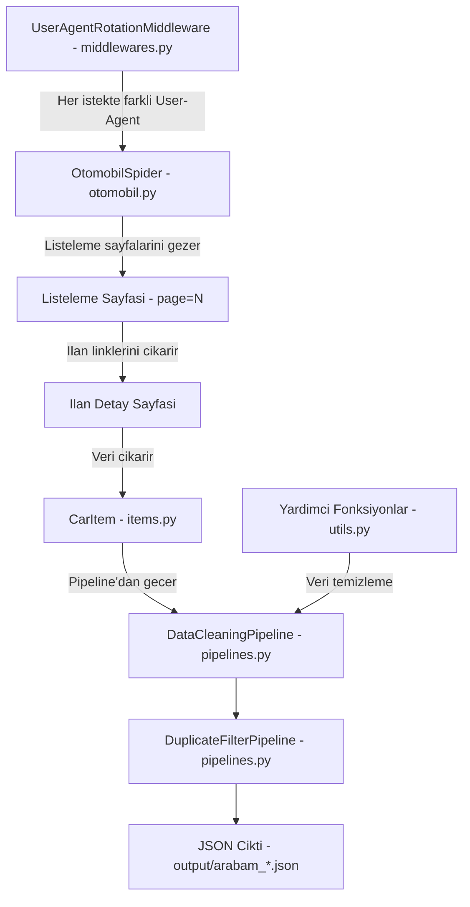

# arabam.com Scraper

**arabam.com** sitesindeki ikinci el otomobil ilanlarini otomatik olarak kazıyan (scraping) bir **Scrapy** tabanli web scraper.

Amac, arabam.com'daki tum ikinci el otomobil ilanlarini sayfa sayfa gezip, her ilanin detay sayfasina girerek arac bilgilerini (fiyat, kilometre, marka, model, boya-degisen durumu vb.) toplamak ve bunlari **JSON** formatinda kaydetmektir.

## Özellikler

- **Otomatik sayfalama:** Tüm listeleme sayfalarını batch halinde tarar
- **Detaylı veri çıkarma:** Fiyat, km, marka, model, yıl, konum, motor bilgileri, boya-değişen detayları ve daha fazlası
- **Veri temizleme:** Fiyat ve km değerlerini sayısal formata dönüştürür, metin alanlarını normalize eder
- **Tekrar filtreleme:** Aynı ilanın birden fazla kez kaydedilmesini önler
- **User-Agent rotasyonu:** Farklı tarayıcı imzaları ile istek gönderir
- **Polite scraping:** `robots.txt` uyumu, istek gecikmeleri ve hız limitleri
- **Duraklatma/devam:** `JOBDIR` desteği ile yarıda kalan taramalara devam edebilme
- **JSON çıktı:** Veriler zaman damgalı JSON dosyalarına kaydedilir

---

## Proje Mimarisi

### Klasör Yapisi

```
arabam.com-scraping/
├── scrapy.cfg                  # Scrapy proje konfigurasyonu
├── requirements.txt            # Python bagimliliklari (scrapy>=2.11)
├── arabam/
│   ├── __init__.py
│   ├── items.py                # Veri modeli (CarItem - 35+ alan)
│   ├── middlewares.py          # User-Agent rotasyonu
│   ├── pipelines.py            # Veri temizleme + tekrar filtresi
│   ├── settings.py             # Scrapy ayarlari
│   ├── utils.py                # Yardimci fonksiyonlar
│   └── spiders/
│       ├── __init__.py
│       └── otomobil.py         # Ana spider (cekirdek mantik)
├── output/                     # JSON cikti dosyalari
├── logs/                       # Scraping log dosyalari
└── crawls/                     # Resume destegi icin durum dosyalari
```

### Veri Akışı



### Bileşen Görevleri

| Bilesen | Dosya | Gorev |
|---------|-------|-------|
| **Spider** | [spiders/otomobil.py](file:///c:/Users/YOGA/Desktop/A2M2_CheckList/arabam.com-scraping/arabam/spiders/otomobil.py) | Siteyi gezer, listeleme + detay sayfalarini parse eder |
| **Item** | [items.py](file:///c:/Users/YOGA/Desktop/A2M2_CheckList/arabam.com-scraping/arabam/items.py) | Toplanan verinin semasini tanimlar ([CarItem](file:///c:/Users/YOGA/Desktop/A2M2_CheckList/arabam.com-scraping/arabam/items.py#4-51)) |
| **Middleware** | [middlewares.py](file:///c:/Users/YOGA/Desktop/A2M2_CheckList/arabam.com-scraping/arabam/middlewares.py) | 12 farkli User-Agent arasinda rastgele rotasyon yapar |
| **Pipeline** | [pipelines.py](file:///c:/Users/YOGA/Desktop/A2M2_CheckList/arabam.com-scraping/arabam/pipelines.py) | Fiyat/KM temizleme, metin duzenleme, tekrar filtreleme |
| **Utils** | [utils.py](file:///c:/Users/YOGA/Desktop/A2M2_CheckList/arabam.com-scraping/arabam/utils.py) | [clean_price()](file:///c:/Users/YOGA/Desktop/A2M2_CheckList/arabam.com-scraping/arabam/utils.py#4-10), [clean_km()](file:///c:/Users/YOGA/Desktop/A2M2_CheckList/arabam.com-scraping/arabam/utils.py#12-18), [clean_text()](file:///c:/Users/YOGA/Desktop/A2M2_CheckList/arabam.com-scraping/arabam/utils.py#20-27), [extract_listing_id()](file:///c:/Users/YOGA/Desktop/A2M2_CheckList/arabam.com-scraping/arabam/utils.py#29-35) |
| **Settings** | [settings.py](file:///c:/Users/YOGA/Desktop/A2M2_CheckList/arabam.com-scraping/arabam/settings.py) | Gecikme, retry, cache, cikti formati ayarlari |

---

## Dosya Aciklamalari

### 1. [scrapy.cfg](arabam.com-scraper/scrapy.cfg) - Proje Konfigurasyonu

Scrapy framework'unun ana yapilandirma dosyasi. Projenin adini (`arabam`) ve ayarlar modulunu (`arabam.settings`) tanimlar.

### 2. [requirements.txt](arabam.com-scraper/requirements.txt) - Bagimliliklar

Tek bagimlilik: `scrapy>=2.11`. Proje tamamen Scrapy uzerine kurulu.

### 3. [arabam/settings.py](arabam.com-scraper/arabam/settings.py) - Proje Ayarlari

Scraping davranisini kontrol eden tum ayarlar burada:

| Ayar | Deger | Aciklama |
|------|-------|----------|
| `ROBOTSTXT_OBEY` | `True` | robots.txt'e saygili scraping |
| `DOWNLOAD_DELAY` | `2 sn` | Istekler arasi bekleme suresi |
| `CONCURRENT_REQUESTS` | `4` | Ayni anda max 4 istek |
| `RETRY_TIMES` | `3` | Basarisiz istekleri 3 kez tekrar dene |
| `RETRY_HTTP_CODES` | `500, 502, 503, 504, 408, 429` | Hata kodlarinda yeniden dene |
| `HTTPCACHE_ENABLED` | `True` | Gelistirme icin HTTP cache aktif (24 saat) |
| `JOBDIR` | `crawls/otomobil-listing` | Scraping durumunu kaydeder (resume destegi) |

> **Not:** `ROBOTSTXT_OBEY = True` ayari, scraper'in arabam.com'un robots.txt dosyasina uymasini saglar. Bu, **etik scraping** prensibidir.

**Cikti formati:** `output/arabam_<tarih>.json` olarak UTF-8 JSON dosyasi uretir.

### 4. `arabam/items.py` - Veri Modeli (`CarItem`)

Her bir ilan icin toplanan verilerin semasini tanimlar. 3 ana kategoride **35+ alan** icerir:

<details>
<summary><strong>Meta Bilgiler</strong></summary>

- `listing_id` - Ilan numarasi
- `url` - Ilan URL'si
- `scraped_at` - Kazima zamani

</details>

<details>
<summary><strong>Ilan Detaylari</strong></summary>

- `fiyat`, `ilan_basligi`, `sehir`, `ilce`, `ilan_aciklamasi`, `ilan_tarihi`
- `marka`, `seri`, `model`, `yil`, `km`
- `vites_tipi`, `yakit_tipi`, `kasa_tipi`, `renk`
- `motor_hacmi`, `motor_gucu`, `cekis`
- `arac_durumu`, `ort_yakit_tuketimi`, `yakit_deposu`
- `agir_hasarli`, `takasa_uygun`, `kimden`

</details>

<details>
<summary><strong>Boya-Degisen Durumu (13 parca)</strong></summary>

- `sag_arka_camurluk`, `arka_kaput`, `sol_arka_camurluk`
- `sag_arka_kapi`, `sag_on_kapi`, `tavan`
- `sol_arka_kapi`, `sol_on_kapi`, `sag_on_camurluk`
- `motor_kaputu`, `sol_on_camurluk`, `on_tampon`, `arka_tampon`

</details>

### 5. `arabam/spiders/otomobil.py` - Ana Spider (Cekirdek Mantik)

Projenin **en onemli dosyasi**. Iki asamali bir scraping stratejisi kullanir:

**Asama 1: Listeleme Sayfalarini Gezme (`parse_listing`)**

1. `https://www.arabam.com/ikinci-el/otomobil?page=1` ile baslar
2. Ilk sayfada **toplam ilan sayisini** `window.productDetail` JSON'undan cikarir
3. Toplam sayfa sayisini hesaplar
4. **Batch sistemi** ile sayfalari 5'erli gruplar halinde kuyruga alir (sunucuya asiri yuk bindirmemek icin)
5. Her sayfadaki ilan linklerini (`/ilan/...`) bulur ve detay sayfalarina yonlendirir

**Asama 2: Ilan Detaylarini Cikarma (`parse_detail`)**

Her ilan detay sayfasi icin su kaynaklar parse edilir:

| Kaynak | Cikarilan Veri |
|--------|----------------|
| `window.productDetail` JS degiskeni | Fiyat bilgisi |
| `dataLayer` (`CD_il`, `CD_ilce`) | Sehir ve ilce |
| CSS selector (`.sticky-information-title`) | Ilan basligi |
| CSS selector (`#tab-description`) | Ilan aciklamasi |
| `.property-item` tablosu | Tum teknik ozellikler (marka, model, km, yakit vb.) |
| `window.damage` JS degiskeni | Boya-degisen durumu (13 parca detayi) |

> **Ipucu:** Spider, verileri hem HTML'den (CSS selector) hem de sayfadaki **JavaScript degiskenlerinden** (regex ile) cikarir. Bu, arabam.com'un verileri hem HTML'de hem de JS'de tutmasindan kaynaklanir.

### 6. `arabam/middlewares.py` - User-Agent Rotasyonu

Her HTTP isteginde **12 farkli tarayici User-Agent** arasindan rastgele birini secer. Bu sayede:

- Scraper bir bot gibi gorunmez
- Chrome, Firefox, Safari, Edge gibi farkli tarayicilari taklit eder
- Hem Windows, Mac, Linux platformlarini simule eder

### 7. `arabam/pipelines.py` - Veri Isleme Hatti

Iki asamali pipeline:

**`DataCleaningPipeline` (oncelik: 100):**
- Fiyat temizleme: `"1.250.000 TL"` → `1250000`
- Kilometre temizleme: `"45.000 km"` → `45000`
- Yil'i integer'a cevirme
- Tum metin alanindan fazla bosluklari temizleme

**`DuplicateFilterPipeline` (oncelik: 200):**
- Ayni `listing_id`'ye sahip ilanlari tespit edip atar
- Tekrarlanan veri kaydini onler

### 8. `arabam/utils.py` - Yardimci Fonksiyonlar

4 temel yardimci fonksiyon:

| Fonksiyon | Aciklama |
|-----------|----------|
| `clean_price()` | Fiyat string'ini sayiya cevirir |
| `clean_km()` | Kilometre string'ini sayiya cevirir |
| `clean_text()` | Fazla bosluklari temizler |
| `extract_listing_id()` | URL'den ilan ID'sini cikarir |

---

## Calisma Akisi


---

## Log Uyarıları

Log dosyasinda 2 adet **deprecation uyarisi** var:

> **Uyari:** `process_request()` ve `process_item()` metodlari `spider` argumani almalidir.
> Gelecek Scrapy surumlerinde bu arguman zorunlu olacak. Mevcut kodda bu parametre eksik:
>
> | Dosya | Mevcut | Olmasi Gereken |
> |-------|--------|----------------|
> | `middlewares.py` | `process_request(self, request)` | `process_request(self, request, spider)` |
> | `pipelines.py` | `process_item(self, item)` | `process_item(self, item, spider)` |

---

## Sonuç

Bu proje, **arabam.com'dan ikinci el otomobil verisi toplayan profesyonel bir web scraper**dir. A2M2 projesinin **makine ogrenmesi modeli egitimi** ve **piyasa degeri tahmini** icin gereken veri setini olusturma amaciyla kullanilmaktadir.

## Ayarlar

Temel ayarlar `arabam/settings.py` dosyasında yapılandırılabilir:

| Ayar | Varsayılan | Açıklama |
|------|-----------|----------|
| `DOWNLOAD_DELAY` | 2 sn | İstekler arası bekleme süresi |
| `CONCURRENT_REQUESTS` | 4 | Eşzamanlı istek sayısı |
| `HTTPCACHE_ENABLED` | True | HTTP önbellekleme |
| `RETRY_TIMES` | 3 | Başarısız istekleri tekrar deneme sayısı |

## Kullanım

```bash
# Tüm ilanları tara
scrapy crawl otomobil
```

Çıktılar varsayılan olarak `output/` klasörüne, loglar `logs/` klasörüne kaydedilir.

**Efektif çalıştırma için USAGE.md dosyasını kontrol ediniz.**
