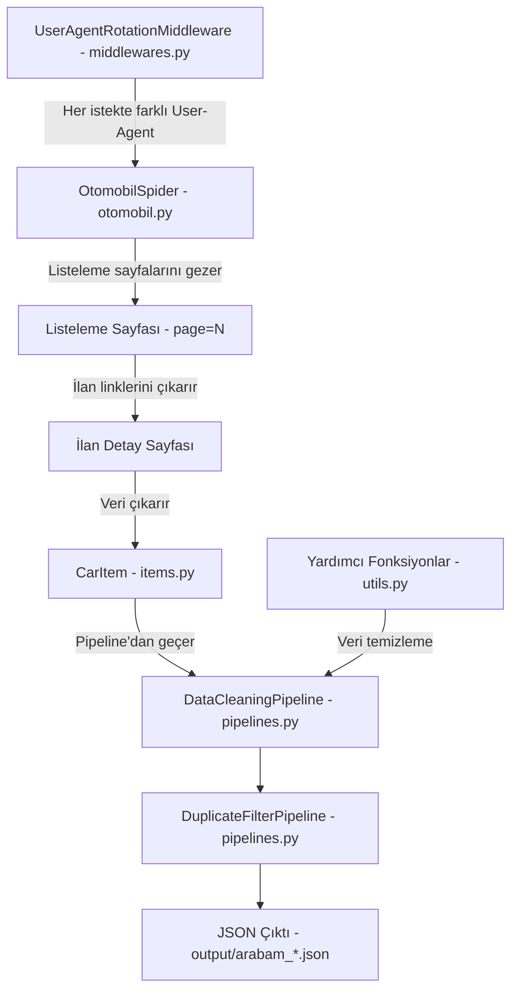
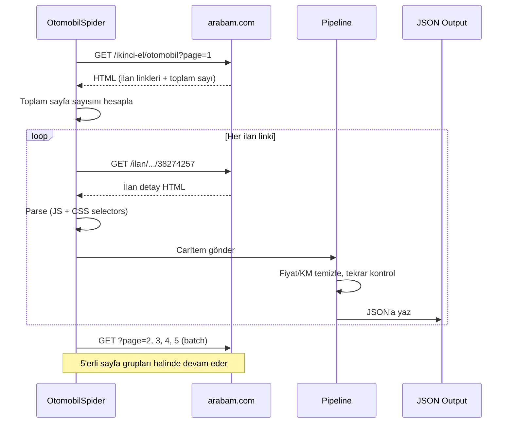

# arabam.com Scraper

**arabam.com** sitesindeki ikinci el otomobil ilanlarını otomatik olarak kazıyan (scraping) bir **Scrapy** tabanlı web scraper.

Amaç, arabam.com'daki tüm ikinci el otomobil ilanlarını sayfa sayfa gezip, her ilanın detay sayfasına girerek araç bilgilerini (fiyat, kilometre, marka, model, boya-değişen durumu vb.) toplamak ve bunları **JSON** formatında kaydetmektir.

## Özellikler

- **Otomatik sayfalama:** Tüm listeleme sayfalarını batch halinde tarar
- **Detaylı veri çıkarma:** Fiyat, km, marka, model, yıl, konum, motor bilgileri, boya-değişen detayları ve daha fazlası
- **Veri temizleme:** Fiyat ve km değerlerini sayısal formata dönüştürür, metin alanlarını normalize eder
- **Tekrar filtreleme:** Aynı ilanın birden fazla kez kaydedilmesini önler
- **User-Agent rotasyonu:** Farklı tarayıcı imzaları ile istek gönderir
- **Polite scraping:** `robots.txt` uyumu, istek gecikmeleri ve hız limitleri
- **Duraklatma/devam:** `JOBDIR` desteği ile yarıda kalan taramalara devam edebilme
- **JSON çıktı:** Veriler zaman damgalı JSON dosyalarına kaydedilir

---

## Proje Mimarisi

### Klasör Yapısı

```
arabam.com-scraping/
├── scrapy.cfg                  # Scrapy proje konfigürasyonu
├── requirements.txt            # Python bağımlılıkları (scrapy>=2.11)
├── arabam/
│   ├── __init__.py
│   ├── items.py                # Veri modeli (CarItem - 35+ alan)
│   ├── middlewares.py          # User-Agent rotasyonu
│   ├── pipelines.py            # Veri temizleme + tekrar filtresi
│   ├── settings.py             # Scrapy ayarları
│   ├── utils.py                # Yardımcı fonksiyonlar
│   └── spiders/
│       ├── __init__.py
│       └── otomobil.py         # Ana spider (çekirdek mantık)
├── output/                     # JSON çıktı dosyaları
├── logs/                       # Scraping log dosyaları
└── crawls/                     # Resume desteği için durum dosyaları
```

### Veri Akışı



### Bileşen Görevleri

| Bileşen | Dosya | Görev |
|---------|-------|-------|
| **Spider** | [spiders/otomobil.py](file:///c:/Users/YOGA/Desktop/A2M2_CheckList/arabam.com-scraping/arabam/spiders/otomobil.py) | Siteyi gezer, listeleme + detay sayfalarını parse eder |
| **Item** | [items.py](file:///c:/Users/YOGA/Desktop/A2M2_CheckList/arabam.com-scraping/arabam/items.py) | Toplanan verinin şemasını tanımlar ([CarItem](file:///c:/Users/YOGA/Desktop/A2M2_CheckList/arabam.com-scraping/arabam/items.py#4-51)) |
| **Middleware** | [middlewares.py](file:///c:/Users/YOGA/Desktop/A2M2_CheckList/arabam.com-scraping/arabam/middlewares.py) | 12 farklı User-Agent arasında rastgele rotasyon yapar |
| **Pipeline** | [pipelines.py](file:///c:/Users/YOGA/Desktop/A2M2_CheckList/arabam.com-scraping/arabam/pipelines.py) | Fiyat/KM temizleme, metin düzenleme, tekrar filtreleme |
| **Utils** | [utils.py](file:///c:/Users/YOGA/Desktop/A2M2_CheckList/arabam.com-scraping/arabam/utils.py) | [clean_price()](file:///c:/Users/YOGA/Desktop/A2M2_CheckList/arabam.com-scraping/arabam/utils.py#4-10), [clean_km()](file:///c:/Users/YOGA/Desktop/A2M2_CheckList/arabam.com-scraping/arabam/utils.py#12-18), [clean_text()](file:///c:/Users/YOGA/Desktop/A2M2_CheckList/arabam.com-scraping/arabam/utils.py#20-27), [extract_listing_id()](file:///c:/Users/YOGA/Desktop/A2M2_CheckList/arabam.com-scraping/arabam/utils.py#29-35) |
| **Settings** | [settings.py](file:///c:/Users/YOGA/Desktop/A2M2_CheckList/arabam.com-scraping/arabam/settings.py) | Gecikme, retry, cache, çıktı formatı ayarları |

---

## Dosya Açıklamaları

### 1. [scrapy.cfg](arabam.com-scraper/scrapy.cfg) - Proje Konfigürasyonu

Scrapy framework'ünün ana yapılandırma dosyası. Projenin adını (`arabam`) ve ayarlar modülünü (`arabam.settings`) tanımlar.

### 2. [requirements.txt](arabam.com-scraper/requirements.txt) - Bağımlılıklar

Tek bağımlılık: `scrapy>=2.11`. Proje tamamen Scrapy üzerine kurulu.

### 3. [arabam/settings.py](arabam.com-scraper/arabam/settings.py) - Proje Ayarları

Scraping davranışını kontrol eden tüm ayarlar burada:

| Ayar | Değer | Açıklama |
|------|-------|----------|
| `ROBOTSTXT_OBEY` | `True` | robots.txt'e saygılı scraping |
| `DOWNLOAD_DELAY` | `2 sn` | İstekler arası bekleme süresi |
| `CONCURRENT_REQUESTS` | `4` | Aynı anda max 4 istek |
| `RETRY_TIMES` | `3` | Başarısız istekleri 3 kez tekrar dene |
| `RETRY_HTTP_CODES` | `500, 502, 503, 504, 408, 429` | Hata kodlarında yeniden dene |
| `HTTPCACHE_ENABLED` | `True` | Geliştirme için HTTP cache aktif (24 saat) |
| `JOBDIR` | `crawls/otomobil-listing` | Scraping durumunu kaydeder (resume desteği) |

> **Not:** `ROBOTSTXT_OBEY = True` ayarı, scraper'ın arabam.com'un robots.txt dosyasına uymasını sağlar. Bu, **etik scraping** prensibidir.

**Çıktı formatı:** `output/arabam_<tarih>.json` olarak UTF-8 JSON dosyası üretir.

### 4. `arabam/items.py` - Veri Modeli (`CarItem`)

Her bir ilan için toplanan verilerin şemasını tanımlar. 3 ana kategoride **35+ alan** içerir:

<details>
<summary><strong>Meta Bilgiler</strong></summary>

- `listing_id` - İlan numarası
- `url` - İlan URL'si
- `scraped_at` - Kazıma zamanı

</details>

<details>
<summary><strong>İlan Detayları</strong></summary>

- `fiyat`, `ilan_basligi`, `sehir`, `ilce`, `ilan_aciklamasi`, `ilan_tarihi`
- `marka`, `seri`, `model`, `yil`, `km`
- `vites_tipi`, `yakit_tipi`, `kasa_tipi`, `renk`
- `motor_hacmi`, `motor_gucu`, `cekis`
- `arac_durumu`, `ort_yakit_tuketimi`, `yakit_deposu`
- `agir_hasarli`, `takasa_uygun`, `kimden`

</details>

<details>
<summary><strong>Boya-Değişen Durumu (13 parça)</strong></summary>

- `sag_arka_camurluk`, `arka_kaput`, `sol_arka_camurluk`
- `sag_arka_kapi`, `sag_on_kapi`, `tavan`
- `sol_arka_kapi`, `sol_on_kapi`, `sag_on_camurluk`
- `motor_kaputu`, `sol_on_camurluk`, `on_tampon`, `arka_tampon`

</details>

### 5. `arabam/spiders/otomobil.py` - Ana Spider (Çekirdek Mantık)

Projenin **en önemli dosyası**. İki aşamalı bir scraping stratejisi kullanır:

**Aşama 1: Listeleme Sayfalarını Gezme (`parse_listing`)**

1. `https://www.arabam.com/ikinci-el/otomobil?page=1` ile başlar
2. İlk sayfada **toplam ilan sayısını** `window.productDetail` JSON'undan çıkarır
3. Toplam sayfa sayısını hesaplar
4. **Batch sistemi** ile sayfaları 5'erli gruplar halinde kuyruğa alır (sunucuya aşırı yük bindirmemek için)
5. Her sayfadaki ilan linklerini (`/ilan/...`) bulur ve detay sayfalarına yönlendirir

**Aşama 2: İlan Detaylarını Çıkarma (`parse_detail`)**

Her ilan detay sayfası için şu kaynaklar parse edilir:

| Kaynak | Çıkarılan Veri |
|--------|----------------|
| `window.productDetail` JS değişkeni | Fiyat bilgisi |
| `dataLayer` (`CD_il`, `CD_ilce`) | Şehir ve ilçe |
| CSS selector (`.sticky-information-title`) | İlan başlığı |
| CSS selector (`#tab-description`) | İlan açıklaması |
| `.property-item` tablosu | Tüm teknik özellikler (marka, model, km, yakıt vb.) |
| `window.damage` JS değişkeni | Boya-değişen durumu (13 parça detayı) |

> **İpucu:** Spider, verileri hem HTML'den (CSS selector) hem de sayfadaki **JavaScript değişkenlerinden** (regex ile) çıkarır. Bu, arabam.com'un verileri hem HTML'de hem de JS'de tutmasından kaynaklanır.

### 6. `arabam/middlewares.py` - User-Agent Rotasyonu

Her HTTP isteğinde **12 farklı tarayıcı User-Agent** arasından rastgele birini seçer. Bu sayede:

- Scraper bir bot gibi görünmez
- Chrome, Firefox, Safari, Edge gibi farklı tarayıcıları taklit eder
- Hem Windows, Mac, Linux platformlarını simüle eder

### 7. `arabam/pipelines.py` - Veri İşleme Hattı

İki aşamalı pipeline:

**`DataCleaningPipeline` (öncelik: 100):**
- Fiyat temizleme: `"1.250.000 TL"` → `1250000`
- Kilometre temizleme: `"45.000 km"` → `45000`
- Yıl'ı integer'a çevirme
- Tüm metin alanından fazla boşlukları temizleme

**`DuplicateFilterPipeline` (öncelik: 200):**
- Aynı `listing_id`'ye sahip ilanları tespit edip atar
- Tekrarlanan veri kaydını önler

### 8. `arabam/utils.py` - Yardımcı Fonksiyonlar

4 temel yardımcı fonksiyon:

| Fonksiyon | Açıklama |
|-----------|----------|
| `clean_price()` | Fiyat string'ini sayıya çevirir |
| `clean_km()` | Kilometre string'ini sayıya çevirir |
| `clean_text()` | Fazla boşlukları temizler |
| `extract_listing_id()` | URL'den ilan ID'sini çıkarır |

---

## Çalışma Akışı



---

## Log Uyarıları

Log dosyasında 2 adet **deprecation uyarısı** var:

> **Uyarı:** `process_request()` ve `process_item()` metodları `spider` argümanı almalıdır.
> Gelecek Scrapy sürümlerinde bu argüman zorunlu olacak. Mevcut kodda bu parametre eksik:
>
> | Dosya | Mevcut | Olması Gereken |
> |-------|--------|----------------|
> | `middlewares.py` | `process_request(self, request)` | `process_request(self, request, spider)` |
> | `pipelines.py` | `process_item(self, item)` | `process_item(self, item, spider)` |

---

## Sonuç

Bu proje, **arabam.com'dan ikinci el otomobil verisi toplayan profesyonel bir web scraper**'dır. A2M2 projesinin **makine öğrenmesi modeli eğitimi** ve **piyasa değeri tahmini** için gereken veri setini oluşturma amacıyla kullanılmaktadır.

## Ayarlar

Temel ayarlar `arabam/settings.py` dosyasında yapılandırılabilir:

| Ayar | Varsayılan | Açıklama |
|------|-----------|----------|
| `DOWNLOAD_DELAY` | 2 sn | İstekler arası bekleme süresi |
| `CONCURRENT_REQUESTS` | 4 | Eşzamanlı istek sayısı |
| `HTTPCACHE_ENABLED` | True | HTTP önbellekleme |
| `RETRY_TIMES` | 3 | Başarısız istekleri tekrar deneme sayısı |

## Kullanım

```bash
# Tüm ilanları tara
scrapy crawl otomobil
```

Çıktılar varsayılan olarak `output/` klasörüne, loglar `logs/` klasörüne kaydedilir.

**Efektif çalıştırma için USAGE.md dosyasını kontrol ediniz.**
